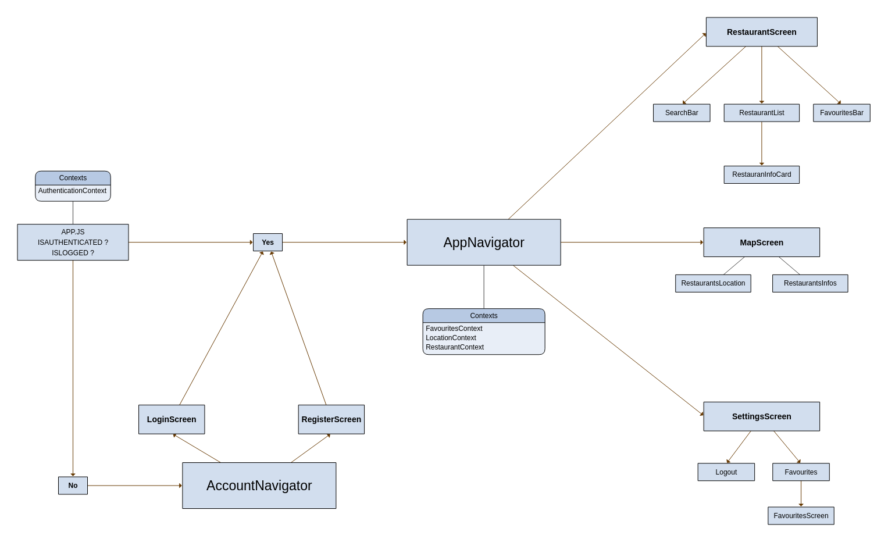

## MealsToGo App

Projeto em React Native de um aplicativo que mostra os Restaurantes e suas respectivas informações baseados em um determinado local.

A primeira Build e branch Main do projeto apenas traz os restaurantes e suas informações que estao mockadas, ou seja, informações estáticas.

Posteriormente estarei fazendo implementação com o modulo do RN para que possa utilizar a Camera do dispositivo para atualizar a foto de perfil e farei também a integração com o GoogleMaps para informações dinâmicas.

Este aplicativo foi desenvolvido apenas para metódos didáticos e tem por base os métodos aplicados e ensinados no curso [React Native Zero to Mastery (With Hooks)](https://www.udemy.com/course/complete-react-native-mobile-development-zero-to-mastery-with-hooks/).

Abaixo segue uma imagem que pode mostrar previamente uma ideia de como a estrutura do aplicativo foi desenvolvida:

## Tecnologias Utilizadas :

- Firebase  
- Javascript  
- React Native  

## Atenção!!
Por favor verifique o arquivo authenticationService e preencha os dados do firebaseConfig com suas proprias configurações fornecidas pelo firebase.

## Instalacao

- `npm install`
    ou  
- `yarn install`

## Para rodar

- `npm run web`
- `npm run ios`
- `npm run android`
    ou  
- `yarn web`
- `yarn ios`
- `yarn android`
